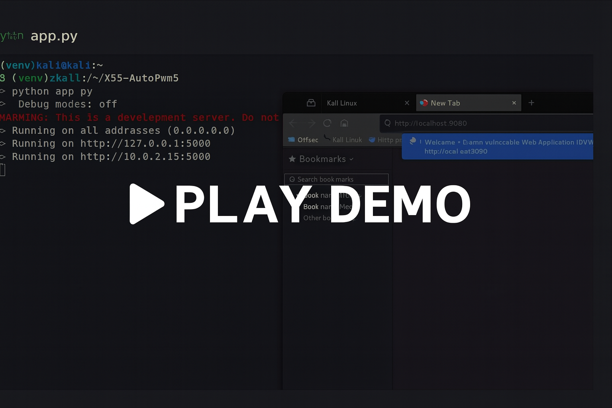

#  Automated XSS Scanner
 
Built on **Kali Linux** using **Python, Flask, Selenium, DVWA**

##  Overview

XSS AutoPwn Demo is a Python-based tool that automates the process of detecting and exploiting Reflected Cross-Site Scripting (XSS) vulnerabilities.
It uses Flask for the dashboard, Selenium for browser automation, and ReportLab for generating professional PDF reports.

## Website used for Exploitation 
**Damn Vulnerable Web Application(DVWA)**

The tool automatically:

Locates target input fields

Injects multiple XSS payloads

Detects JavaScript execution

Captures screenshots as proof

Generates PDF reports

Displays results through a simple web UI

---
##  Demo Video

[](Xss-Demo.gif)


## Features
- Login to DVWA
- Scan for reflected XSS
- Inject payload → Take screenshot
- Generate PDF report
- Web dashboard: `http://localhost:5000`

---

## Setup
```bash
git clone https://github.com/REALFB007/XSS-AutoPwn-Demo.git
cd XSS-AutoPwn-Demo
python -m venv venv
source venv/bin/activate
pip install -r requirements.txt
docker run --rm -it -p 8080:80 vulnerables/web-dvwa
python app.py
